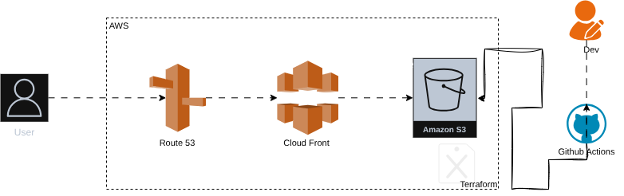

# React App on AWS

## Architecture

### Components

- **GitHub Repo**: Contains React front-end and Terraform infrastructure code.
- **GitHub Actions**: CI/CD pipeline to build React and deploy with Terraform.
- **Terraform**: Manages S3, CloudFront, ACM, and optional Route53.
- **S3 Bucket**: Stores React build files.
- **CloudFront Distribution**: Serves React app globally with caching and SSL.
- **ACM Certificate**: Provides TLS for HTTPS.
- **Route53 (optional)**: Domain management and DNS validation for ACM.
